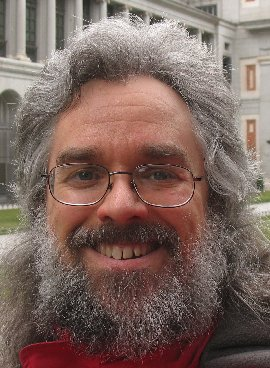

#COMP116 Assignment 5: Forensics
##Will Clarkson and A.J. Jenkins

Note from AJ: I wanted you to know that Will did the majority of the work on the
assignment.

###Hidden Data in Images
1. Examine the following series of images to determine any differences and reveal 
any hidden information in the image that is different from the others. Please 
detail your steps!
        We used diff on the 3 images to determine that the first
        was different than the other two. We then used steghide to extract an image from 
        a.jpg, with an empty password:
        
        We also attempted to use steghide on the hidden image, but after trying 1000 
        passwords from the common password list in John the Ripper (using a Perl script), 
        we stopped trying.

###Disk Image
1. What is/are the disk format(s) of the SD card?
        There is a 7.88 GB ext4 partition and a 64 MB FAT32 partition.
2. Is there a phone carrier involved?
        No.
3. What operating system, including version number, is being used? Please 
elaborate how you determined this information.
        Kali Linux, kernel version 3.6.11-cutdown
4. What other applications are installed? Please elaborate how you determined 
this information.
        John the ripper, ettercap, dd_rescue, scalpel, metasploit, and many 
        others (found in /usr/bin/ directory).
5. Is there a root password? If so, what is it?
        The root password is ‘toor’. We extracted the /etc/passwd and 
        /etc/shadow files from the disk image and used John the Ripper to crack 
        the hashed root password.
6. Are there any additional user accounts on the system?
        Based on the /etc/passwd file, there do not appear to be any other users on the system.
7. List some of the incriminating evidence that you found. Please elaborate 
where and how you uncovered the evidence.
        In the root user’s home directory (/root/) there are pictures of Celine 
        Dion, text files with setlists, and a text file with tour dates from 
        December 2013 to March 2014. There is also a file containing a spotify 
        link to her album “My Love: Essential Collection”.
8. Did the suspect move or try to delete any files before his arrest? Please 
list the name(s) of the file(s) and any indications of their contents that you can find.
        The suspect deleted 3 jpegs from their /root directory. Many other files 
        were also deleted before the hard drive was recovered, including the 
        contents of /etc, /home, and other directories.
9. Are there any encrypted files? If so, list the contents and a brief description 
of how you obtained the contents.
        Yes. There was a 20 MB file called Dropbox.zip in the root users’s home 
        folder which looked suspicious because it was not really a zip file. 
        Assuming it was a TrueCrypt file, we used truecrack to brute force the 
        password with the wordlist from John the Ripper. The password was 
        “iloveyou” and contained a video of Celine Dion singing Open Arms and a 
        picture of the program and ticket from the concert at Caesar’s Palace. 
10. Did the suspect at one point go to see this celebrity? If so, note the date 
and location where the suspect met the celebrity? Please elaborate how you 
determined this information.
        The suspect went to see Celine Dion at The Colosseum at Caesar’s Palace 
        in Las Vegas. This was determined from PDF of of an email confirmation 
        from Ticketmaster that was recovered from the suspect’s hard drive.
11. Is there anything peculiar about the files on the system?
        The suspect seemed to be involved in some form of security work, 
        because many security and pen-testing tools were installed. The disk 
        appears to have been running on a Raspberry Pi based on commands in the 
        bash history.
12. Who is the celebrity that the suspect has been stalking?
        Celine Dion.
